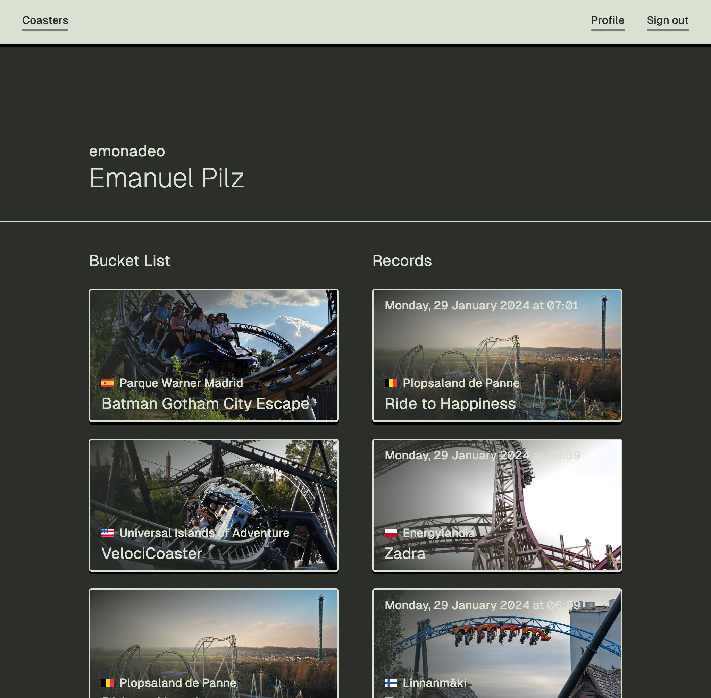
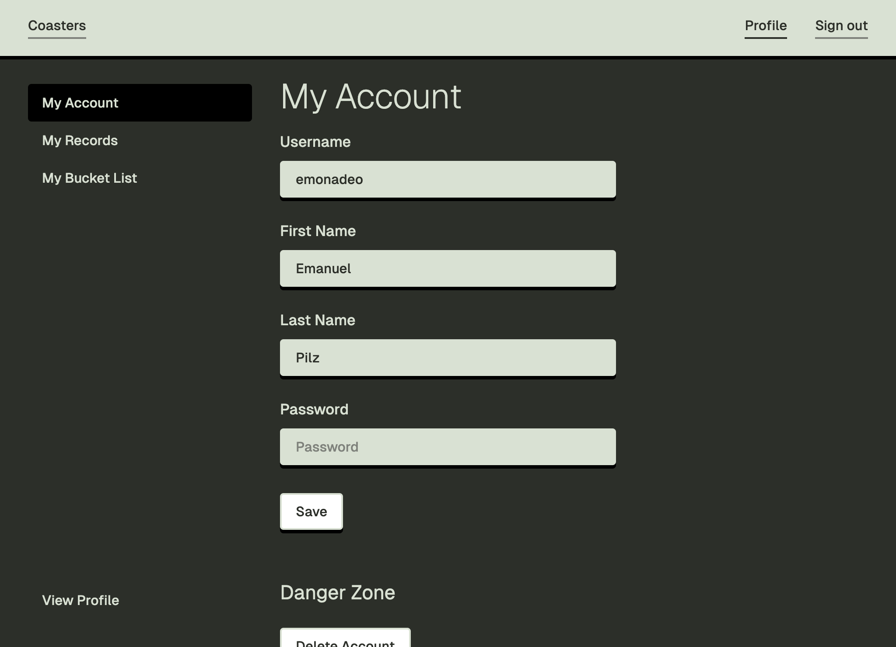

# Rodeit

**[Website](https://rodeit.mabezi.de/)** &mdash; **[API Reference](https://rodeit.mabezi.de/docs/)**

- 🎢 Record what coasters you have ridden
- 📋 Create a bucket list with coasters you want to ride
- 🙋 See records and bucket lists of other users
- 🏆 Visualize statistics, like most ridden and most wanted coasters

## Authors

This project is a collaborative effort by:

- Emanuel Pilz
- Fabian Krusch
- Markus Ziehe

---

> The remaining README is in german.
> Die restliche README ist auf deutsch.

---

## Verwendung

### `/signup`
Registrierung von Nutzern (Benutzername, Vorname, Nachname, Passwort)


### `/login` 
Login durch Benutzernamen und Passwort


### `/logout` 
Loggt den Nutzer aus und leitet auf `/` weiter.

### `/`
Zeigt alle bekannten Achterbahnen an. Sortierbar nach: Meiste Fahrten, Beliebtheit


### `/?search=silver`
Durchsucht alle Achterbahnen nach Namen.


### `/coaster/{id}`


### `/users/{id}`


### `/profile`


### `/profile/bucket_list`
Zeigt die eigene Bucketlist, sortiert nach persönlicher Reihenfolge


### `/profile/records`
Zeigt die eigenen Records, sortiert nach Datum


## Verwendete Plattformen und Software

### Hinweise für Installation

> **Docker muss bereits installiert sein!**

#### Cloud&Heat VM
1. cd /opt/gruppe1/
2. sudo su
3. docker compose down && docker compose up -d

#### Linux, Mac
1. Im Hauptverzeichnis `./setup.sh` ausführen
2. `docker compose up -d` ausführen

#### Windows
1. Alle Docker Images bauen
2. `docker compose up -d` ausführen

#### Image in die Registry hochladen
> Hinweis: Für `VERSION` muss selbstverständlich eine Version eingesetzt werden.
```
docker push gcr.hrz.tu-chemnitz.de/praktikum-scc/ws23-gruppe1/gruppe1/bucket_list:VERSION
docker push gcr.hrz.tu-chemnitz.de/praktikum-scc/ws23-gruppe1/gruppe1/user:VERSION
docker push gcr.hrz.tu-chemnitz.de/praktikum-scc/ws23-gruppe1/gruppe1/records:VERSION
docker push gcr.hrz.tu-chemnitz.de/praktikum-scc/ws23-gruppe1/gruppe1/web:VERSION
```

### Plattformen
- GitLab
-- GitLab Registry (Speichern der Docker-Images)
- GitHub-Pages (Hosten von Scalar)
- Scalar (OpenAPI-Schnittstellenbeschreibung)
- Docker

### Services

#### `bucket_list`
- **Rust**
- [axum](https://github.com/tokio-rs/axum) (Web-Framework)
- [aide](https://github.com/tamasfe/aide) (code-first OpenAPI)
- [SurrealDB](https://surrealdb.com/)
- [anyhow](https://github.com/dtolnay/anyhow)
- [auth](#auth)

#### `records`
- **Python**
- SQLite

##### Libraries
- [Flask](https://flask.palletsprojects.com/en/3.0.x/)
- [Connexion](https://connexion.readthedocs.io/en/latest/)
- [Marshmallow](https://marshmallow.readthedocs.io/en/stable/)
- [SQLAlchemy](https://www.sqlalchemy.org/)
- [Python JOSE](https://python-jose.readthedocs.io/en/latest/)

#### `user`
- **Rust**
- SQLite
- [Axum](https://github.com/tokio-rs/axum) (Web-Framework)
- [sqlx](https://github.com/launchbadge/sqlx)
- [tokio](https://tokio.rs/)
- [utoipa](https://github.com/juhaku/utoipa)
- [serde](https://serde.rs/)
- [auth](#auth)

### Teilpakete (packages)

#### `auth`

> Wird von `bucket_list` und `user` genutzt

- [jsonwebtoken](https://jwt.io/)

## Vorgehensweise

### Wöchentliche Meetings

 - Klärung von Fragen/Problemen
 - Besprechen des weiteren Vorgehens
 - Coden

### Anfängliche Planung

 1. Ideensuche (Hobby -> Webseite)
 2. Grobe Pläne, andere Webseiten angeschaut
 3. Brainstorming
 4. Absprache der eingesetzen Software & Plattformen
 5. Implementierung

### Brainstorming

> Der `rating` Service wurde aus Zeitgründen gestrichen


